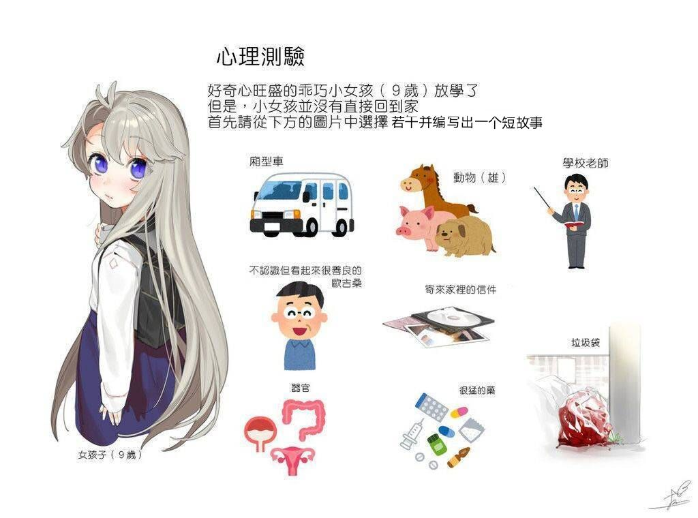

# 回荡 · 天之阶

## Topic

](./res/2020.08.12.jpg)

## 元素梳理

* 女孩子：星野天忆的量产后代
* 厢型车：卖药的车
* 欧吉桑：林博（成年）
* 寄来家里的信件：天怡寄给林博的信件，其内容是引诱天忆使用黑色噩梦转移及生物化的药物
* 很猛的药：黑色噩梦转移及生物化的药物
* 垃圾袋：林博的尸体
* 学校老师：星野樱
* 器官：天忆的脑组织（是血质量较为丰富的器官，并且是灵魂容器，估计更能提高黑色噩梦带来的效果）
* 动物（雄）：量产天忆的工具

## 阅读须知
 
* 林博：雄性，星野天怡的哥哥（小的时候侵犯过天怡）
* 星野天忆：星野天怡的妹妹，无血缘
* 星野樱：普通的老师，和星野天忆没有任何血缘或者是亲近的关系，姓相同只是偶然
* 黑色噩梦：带来负面情绪的神秘物质，似乎并不来自于这个世界
* 崩离之界：黑色噩梦浓度极高的空间，但没有证据表明黑色噩梦来自崩离之界
* 凝滞魔法：将空间冻结的魔法，可以大幅提高物体的强度
* 局星域回溯：操纵时空粒子使局星域内的物质回溯到之前的状态
* 生物化：禁术，简单来说就是把普通的物质转化为活动的生物体

## 正文

“今天表现不错呀”
“是……是吗……诶嘿嘿~”
天忆受到夸奖之后就不自主地露出了笑容
“好啦，快回家吧，时间也不早了”
“嗯！樱老师再见”
“再见”
天忆蹦蹦跳跳走向楼梯

“啊！……”
“这个声音……？是樱老师？”

“樱老师！……您……受伤了……”
“没……没什么事，只是摔伤而已……”
“可是……看起来好严重……”
“真的没事的啦……”
“啊！今天我刚好也要去买药……樱老师现在这里等着，等我去买点药回来哦”
“……好”

“……真是善良啊……”
“是啊”
“啊……林博……”
“先起来吧”
林博伸出手，抓住樱的手
“谢x…………！”

……

“得快点才行，樱老师现在肯定很疼……”
啪嗒啪嗒
布鞋与大路拍打的声音
“啊！就在前面了！”

在前面的是一辆厢型车，对天忆来说，这是她一直来买药的地方
这里的药很丰富，而且好像怎么买都买不完的样子
“那个……请问有摔伤能用的药吗？”
“摔伤吗？那这边这瓶如何？”
“唔……”
天忆粗略地看了看瓶子上面的标签
“嗯……谢谢！”
接着天忆丢下几块冰晶，准备跑开
“对了，还有这瓶也给你吧？”
“诶……？可是……”
“女孩子一个人在外面要小心哦，这瓶魔力水可以暂时提高自己的综合魔法能力，来反击坏人然后逃脱危险哦”
“嗯……谢谢……”
天忆接过魔力水，赶紧跑回学校

“咕呜！……”
长枪穿透了樱的喉咙
另外的四根长刀也将樱的四肢钉在地板上
魔力在侵蚀着她的肉体
鲜血也随之缓缓溢出
染红了金属光泽的长枪
“安分一点，我的目标是天忆，而不是你”
林博看着手中的信件
上面写着的似乎是有谁命令她做什么事，而奖励，则是……
“呜！……”
啪嗒啪嗒
楼梯方向传来脚步声
“来了吗，真快”
“……噫呜呜！！！”
樱准备趁着林博看向楼梯的时候偷袭
但是长枪上突然涌出火焰，雷电，寒冰
“别白费力气了”

“……！？”
天忆被眼前的一幕震惊到说不出话来
鲜血，魔力，还有熟悉但此刻却非常陌生的老师
无论是哪位老师都一样
樱浑身都是鲜血，樱色的头发也因为鲜血而染成了红色
四肢被长刀刺穿，有些关节似乎还异常地扭曲着
甚至断裂
而林博，脸上阴险的面容让天忆的心里有了一丝
不
一万丝恐惧
“诶！……樱……樱老师……？”
药瓶从天忆手中滑落
但魔法水瓶却异常坚硬
没有破碎，而是滚向了前方
“呜！……z……走！……”
“樱老师！！”
“快……z……咕呜呜呜！……”
樱似乎已经快失去意识了
但在最后的时刻仍然想让天忆尽快离开

> “对了，还有这瓶也给你吧？”
> “诶……？可是……”
> “女孩子一个人在外面要小心哦，这瓶魔力水可以暂时提高自己的综合魔法能力，来反击坏人然后逃脱危险哦”
> “嗯……谢谢……”

“对……对了……魔法……魔……魔法水……”
透明的魔法水和瓶子在淡色的地板上格外不显眼
咻！
长枪从远处飞来
虽然击中了天忆
但是由于衣服上有凝滞魔法，还不至于让天忆受伤
只是强大的推力把天忆推到在地
“呜啊！……呜……好疼……”
天忆短暂地被痛苦淹没着
接着又回过神来
试图寻找那瓶魔法水
“啊！”
手边传来特殊的触感
是魔法水瓶无疑
接着天忆一把抓住魔法水瓶
咻！
又一把长枪飞来
但这一把长枪似乎不太一样
它的尾部有着一根魔法金属制作的链子
长枪碰到了天忆的手臂
接着
穿透衣服
“啊！……”
穿透假皮
“呜！……”
穿透真壳
“咕！……”
接着钉在地上
“呜呜……水……魔法水……”
天忆伸出右手，把左手的魔法水拿到嘴边
“咕噜咕噜……”
喝下

“呵……”
林博一阵冷笑
从天忆身上散发出黑色的烟雾
沿着金属链移动到钉着樱的长矛
“诶……怎么……没有效果……呜呜！！！！！！！！！！！！！！！”
随着魔法水的喝下
天忆的身体也发生了特别的变化
左手被穿透的地方逐渐流出了天忆不曾拥有的
人类的血液
“好疼……”
只有简短的两个字
【好疼啊……好疼啊啊啊啊啊啊！…………好疼好疼好疼………………………………】
【好痛苦……脑子里好像有什么进来了……有什么出去了……好晕】
【好疼……好疼…………好……疼………………】
眼前一片昏暗

“终于完成了，那今晚就能好好享用我亲爱的妹妹的~身·体·了~”
咯吱咯吱
“嗯……？”
林博看着传来声音的地方
“……？！”
咯吱咯吱
樱的身体逐渐活动起来
好像没有痛觉一样
任由长刀将关节切断
任由长枪撕裂者脖子
“你……你……”
林博也感受到了恐惧
无论是死亡，痛苦，还是面前这个四肢血肉模糊的樱
“……”
樱（？）闻着远处传来的新鲜的血味
接着窜到天忆身边
“要……要不还是先走吧……”
林博看到这一幕，决定先从最近的楼梯口离开
但
这一层
只有一个楼梯口
“这……究竟是……天怡可没跟我说过这些……”

樱的双手和双足已经被切断了
只能用牙齿啃食着天忆的脑袋
犹如人类所说的丧尸一般

> 好黑
> 樱不知道在哪里睁开了眼睛
> 眼前一片虚无
> 不像是夜空
> 因为没有星星
> 不像是夜空
> 因为也没有月亮
> “啊啦，你醒了？”
> “……你是……？”
> “在下黑色噩梦之一：郑羽依”
> “黑色噩梦……”
> “你可能没有听说过呢，不过和你说了也没什么用”
> “我在哪……”
> “崩离之界”
> “……？”
> “唉……算啦，先开始正题吧”

“……！”
樱似乎听到了脚步声一样，看向后方奔跑的林博
“你……你不要……不要过来……不然我就……”
林博从后方不知道哪里掏出一个有着八根水晶的魔法道具
食用完天忆的樱，四肢以极快的速度恢复
魔力也犹如用不完一般
飞快地冲到林博地面前
“！……那我不……不客气了……！”
星曜「梦陨星锁」
从水晶的尖端涌出魔力
组成了锁链的形状
樱虽然突破了前面几层锁链的封锁
但是最后还是被抓住了
在完全被困住之前，用鲜血凝结成飞刀
刺向林博

> “呜呜呜呜！………………”
> “和我想象中的差很多啊……”
> “呜哈……差……什么……”
> “情绪的丰度，唉，天怡说来这里就能吃一顿好的，结果还是被忽悠了吗……”
> “噫呜！……”
> “算了，有的吃好过没得吃，那我就不客气了”
> “呜啊啊啊啊啊啊啊啊啊啊啊啊啊啊啊啊啊啊啊啊啊啊啊啊啊！！！！…………………………”
> 没有肉体上的伤痕
> 没有鲜血的流出
> 也没有魔力的侵蚀
> 但樱看起来十分痛苦
> 犹如
> 这份痛苦是来自内心的

飞刀穿透了林博的胸膛
将他击倒在地，溅出的污血也溅了樱一脸
虽然樱的脸上本来就已经有很多血痕了
樱用舌头舔了舔嘴巴附近的血液
随后突破封锁
再召唤一把飞刀
将林博的容器核心 —— 大脑 粉碎

> “啊……时间快到了吗……明明还没吃完……”
> “呜……”
> 樱似乎失去了反抗能力一般，瘫倒在地上
> “算了，以后有的时间能吃，那今天就这样吧，后会有期”
> “……”
> “啊不对，明天再见~♡”

未知的地方
“主人……任务……”
“任务怎么了？”
“星野天忆被星野樱吃掉了大脑，容器已经完全不能用了”
“灵魂呢？”
“在学校附近没有相应的灵魂反应，或许……”
“或许灵魂也被樱吃了”
“正是这么猜测的……”
“这次也失败了吗……”
“很抱歉……”
“不是你的错，我再策划新计划吧”
“那，要执行那个吗？”
“嗯，执行「局星域回溯」吧”
“好的”

{-
未知的地方的未知的地方
黑暗的房间里
有个少女被囚禁在满是蓝色液体的罐子里
除了下体还暴露在外面
每一分钟，都有一只雄性动物过来侵犯着她
而罐子里的液体不仅提高着少女灵魂对此的敏感度，更是提升着其产出的灵魂的速度及质量
这位少女
名为星野天忆
她双目无光，嘴巴被类似于老鼠夹的东西紧锁着
-}

不知过了多久
“……”
身上满是血迹的樱终于醒来
但是她不再像一个老师一般微笑着
她侧着头
看着远处身体已经被啃食得千疮百孔的天忆

滴答
滴答
鲜血从天忆的血肉中流出
“天忆……那曾是你经历过的吗……”

随后，樱左手提着一个被染红的白色垃圾袋
右手抱着天忆残破不堪的身体
从楼梯口
离开了

这个世界

## 最后

很遗憾的是，没有想到哪个地方可以体现天忆的好奇心。还有为了防止被删掉，删去了一些关于性的内容。